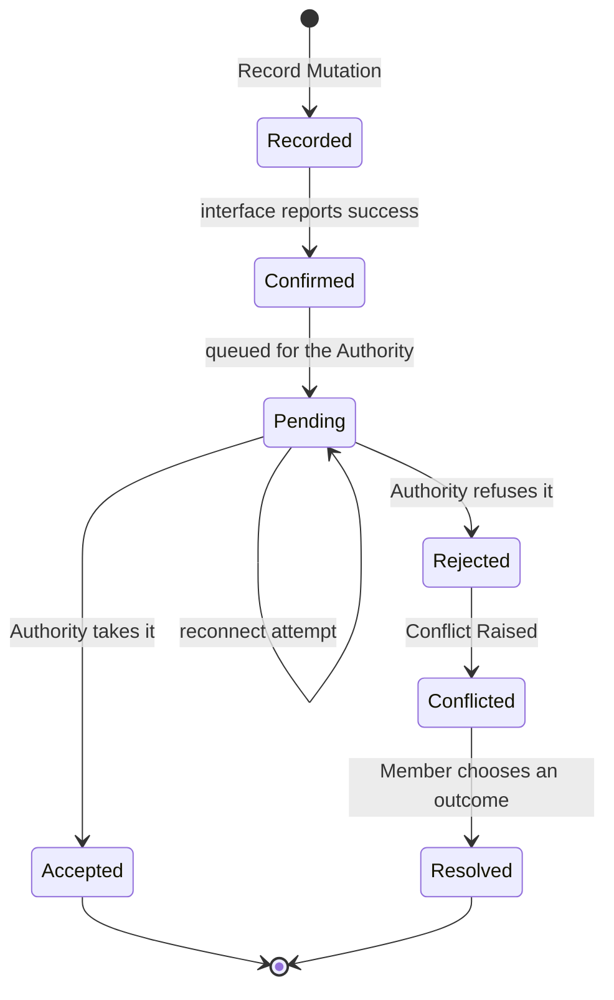
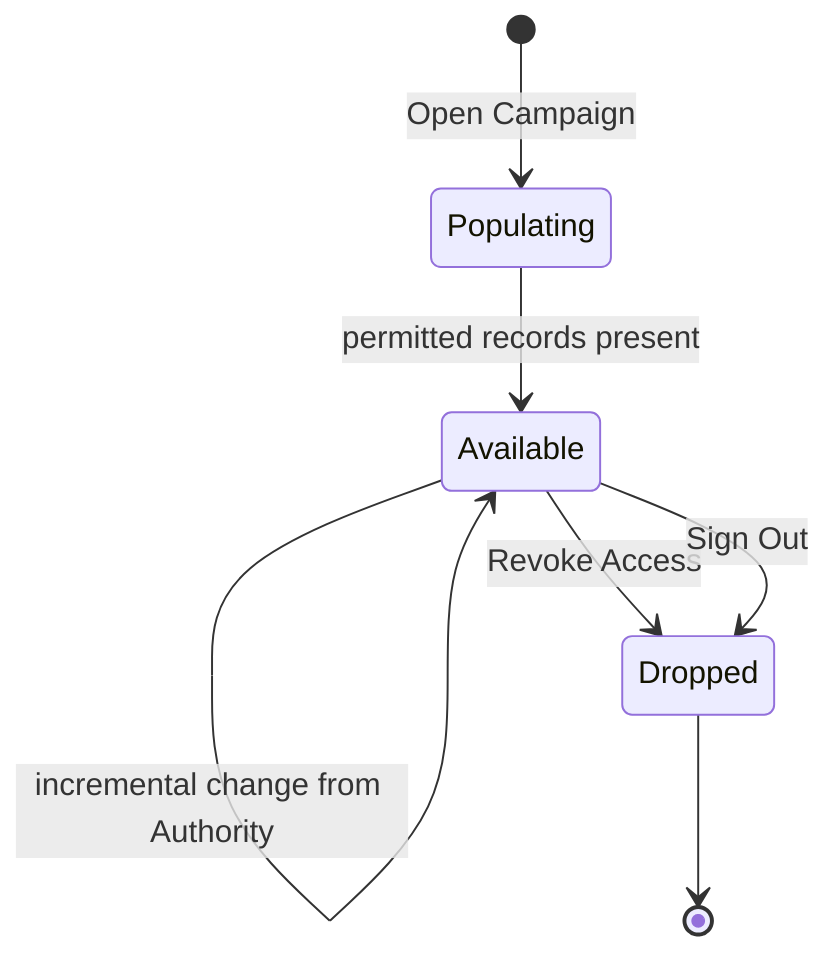

# Domain: Offline-First Sync Platform

Source: `_prd.md`, `_bdd.md`, `../00-platform-foundation/adrs/ADR-001-optimistic-concurrency.md`,
`../00-platform-foundation/freeze-decisions.md`, `../00-platform-foundation/spike-findings.md`.

## Why this feature has a domain at all

Most of this feature is infrastructure, and infrastructure does not earn a domain document. Three
things here do:

1. **A change has a lifecycle with more than one terminal state, and the states are not
   interchangeable.** The PRD and the BDD both use *applied*, *confirmed*, and *accepted* as if
   they were synonyms. The wave 0 spike proved they are not: a change can be applied locally,
   confirmed to the user, and then rejected by the authority
   (`spike-findings.md`, Finding 1). Every user-facing promise in `PRD.md` s.80 depends on
   keeping those three apart.
2. **"Conflict" names two different things** with different timing, different causes, and
   different user experiences.
3. **The invariants are product promises, not technical ones.** "No confirmed change is silently
   discarded" is a statement about trust at a table, and it survives any change of storage
   technology.

Deliberately **not** domain vocabulary, per rule 6: SQLite, OPFS, IndexedDB, VFS, PowerSync,
WAL, replication slot, bucket. The business does not care which of those is used, and `PRD.md`
s.55 requires replacing them to be a change in one boundary. They belong in `_techspec.md`.

The one borderline term kept is **Replica**, because the product does care that a campaign exists
on the device — that is the entire offline promise (`PRD.md` s.76). How it is stored is not domain.

---

## Glossary

The first four rows are the point of this document.

| Term | Means | Explicitly not |
| --- | --- | --- |
| **Recorded** | The change is written to the local Replica and readable there. | Not proof the authority has it. |
| **Confirmed** | The interface has told the member the change took effect. In MVP, confirmation follows recording. | Not acceptance. This is the promise `PRD.md` s.80 protects. |
| **Accepted** | The Authority has taken the change and advanced the record's Version. | Not the same moment as confirmation, and possibly hours later. |
| **Rejected** | The Authority refused the change. Always produces a Conflict, never a silent drop. | Not "lost". A rejected change is still owed an outcome. |
| **Authority** | The shared store whose record of a value is definitive. | Not the read path. Reads are served from the Replica. |
| **Replica** | The copy of one campaign on one device, holding only what its holder may see. | Not a cache. It is authoritative for reads and is written to first. |
| **Mutation** | One intended change to one record, with its own lifecycle. | Not a transaction, and not a request. |
| **Pending Mutation** | A Mutation that is Recorded but not yet Accepted or Rejected. | Not a retry. It has been confirmed to a person. |
| **Version** | A monotonically increasing integer the Authority assigns to a record. | Not a timestamp. Clocks never decide outcomes. |
| **Immediate Conflict** | Rejection known while the member is still acting. | |
| **Deferred Conflict** | Rejection discovered after the member was told the change took effect. | |
| **Change Intent** | Whether a change means *set to*, *adjust by*, or *keep within bounds*. | Not a value. Intent is what makes concurrent changes mergeable. |
| **Hold** | Exclusive right to edit one long-text field, transferable by explicit takeover. | Not a database lock. It is a table etiquette rule with a UI. |
| **Tombstone** | The record of a deletion, which survives so the deletion propagates. | Not an absent row. Absence would let the record resurrect. |
| **Sync State** | What the member is told about their synchronization: synchronized, pending, offline, error. | Not whether a Replica exists. Those are different questions. |

### Terms removed as synonyms

- *applied*, *saved*, *committed* → use **Recorded**, **Confirmed**, or **Accepted**. Which one
  is meant is always load-bearing.
- *local database*, *local copy*, *local store* → **Replica**.
- *server*, *backend*, *remote*, *cloud* → **Authority**.
- *change*, *edit*, *write*, *operation* → **Mutation**, when the lifecycle matters.
- *synced* → ambiguous between "a Replica exists" and "the queue is empty". Say which.

---

## Actors

| Actor | Role in this domain |
| --- | --- |
| **Member** | A person acting in a campaign. This feature does not decide their role; feature 01 resolves it and feature 04 decides what it permits. |
| **Authority** | Holds the definitive Version of every record and is the only party that accepts or rejects a Mutation. |
| **Consuming Feature** | The nineteen other features. They issue Mutations and observe Conflicts. They never see the mechanism. |

---

## Commands

| Command | Issued by | Produces |
| --- | --- | --- |
| Open Campaign | Member | Replica Requested |
| Record Mutation | Consuming Feature | Mutation Recorded, then Mutation Confirmed |
| Drain Queue | System, on reconnection | Mutation Accepted or Mutation Rejected, per Mutation |
| Resolve Conflict | Member | Conflict Resolved |
| Acquire Hold / Take Over Hold / Release Hold | Member | Hold Acquired / Hold Transferred / Hold Released |
| Revoke Access | Feature 01, on membership change | Replica Dropped |
| Sign Out | Member | Replica Dropped, for every campaign |

## Events

Replica Requested · Replica Established · Replica Dropped ·
Mutation Recorded · Mutation Confirmed · Mutation Queued · Mutation Accepted · Mutation Rejected ·
Conflict Raised · Conflict Resolved ·
Hold Acquired · Hold Transferred · Hold Expired · Hold Released ·
Record Tombstoned

---

## Flow 1 — The life of a Mutation

The central model. Every promise in `PRD.md` s.80 is a statement about this diagram.

Two properties matter more than the shape:

- **There is no edge from any state back to nothing.** A Mutation that has been Confirmed leaves
  this diagram only through `Accepted` or `Resolved`. Discarding it anywhere else is the failure
  `PRD.md` s.80 targets at zero.
- **`Confirmed` precedes `Accepted`, and may precede it by hours.** When the member is offline
  the two are separated by the whole outage. Any code or copy that treats confirmation as
  acceptance is wrong, and was wrong even before this feature existed — the spike found it in the
  frozen contract itself.

### Where the two kinds of Conflict come from

Same terminal state, different journey, different user experience.

| | Immediate Conflict | Deferred Conflict |
| --- | --- | --- |
| Member was | still acting | told it worked, possibly long ago |
| Detected | before confirmation | on Drain Queue |
| Member's mental model | "my change did not go through" | "the change I made earlier did not go through" |
| Recovery | retry in context | must be re-presented with context restored |

The second is harder and is the one that damages trust, because the member has already moved on.

---

## Flow 2 — The life of a Replica

Short, but it carries the security invariant.

`Populating` is where the permission filter applies, and it applies at the Authority, not on the
device. A record that a member may not see never enters their Replica. Once a record is on a
device, the interface not showing it is not a control (`PRD.md` s.34, and `_bdd.md`
"A record the actor may not see never arrives").

`Dropped` takes Pending Mutations with it. A revoked member's queued changes are never applied.

---

## Flow 3 — The life of a Hold

Long text is single-writer with explicit takeover (`freeze-decisions.md` FR-012). The domain rule
is short enough not to need a diagram:

A Hold is acquired by the first editor, is visible to everyone else as held by that person, and
transfers only by a deliberate act. Content already saved by a previous holder is never lost by a
transfer — takeover moves the right to edit, not the text.

This exists because merging prose badly is worse than not merging it. Optimistic concurrency on a
long note conflicts on nearly every concurrent edit and offers a choice that discards a paragraph,
which satisfies "no silent overwrite" while losing the work anyway.

---

## Invariants

| # | Invariant | Enforced where |
| --- | --- | --- |
| I1 | A Confirmed Mutation reaches exactly one terminal state: Accepted or Resolved. It is never discarded. | Mutation lifecycle |
| I2 | A Rejected Mutation always raises a Conflict. Rejection is never silent. | Drain Queue |
| I3 | A Conflict is resolved by a Member, never by the system choosing a winner. | Conflict resolution |
| I4 | Version, not any clock, determines whether a Mutation is stale. | Authority |
| I5 | A Replica never contains a record its holder may not see. | Authority, during Populating |
| I6 | Every synchronized record carries a Version and a deletion marker. | Frozen contract, feature 00 |
| I7 | A tombstoned record is never resurrected by a later synchronization. | Tombstone propagation |
| I8 | At most one Hold exists per long-text field. | Hold acquisition |
| I9 | Changes expressed as adjustments merge; changes expressed as absolute values conflict. | Change Intent |
| I10 | Dropping a Replica also drops its Pending Mutations. | Replica lifecycle |

### I9, stated plainly

This is the invariant most likely to be violated by accident, because the wrong choice still
compiles and still looks correct in a single-user test.

`adjust by −3` and `adjust by +2` applied to 6 give 5, and neither is a Conflict. `set to 3` and
`set to 8` applied to 6 are a Conflict, because there is no way to honour both. Damage recorded as
`set to 3` silently destroys a concurrent heal, which is why ADR-001 makes intent explicit rather
than inferring it from a value.

---

## Policies

- **Local first.** The read and write path is the Replica. A round trip to the Authority in that
  path is a defect, not a slow success.
- **Confirm honestly.** The interface may confirm a Recorded Mutation, and must be able to
  un-confirm it later. It must never imply acceptance it does not have.
- **Surface, do not decide.** Where two intents cannot both be honoured, the system presents both
  and a Member decides.
- **Filter at the source.** Permission is applied before data leaves the Authority.
- **Forget deliberately.** Tombstones and Pending Mutations are bounded. Bounded means a stated
  policy, not an accident of disk size.

---

## Relationship to other features

This feature owns the mechanism and none of the meaning.

| Concept | Owned by | This feature's part |
| --- | --- | --- |
| Who a Member is, and their role | 01 | consumes the resolved identity |
| Which visibility rules exist | 04 | enforces them at the Authority boundary |
| What a record means | 15, 16, 17, 18, 19 | moves it without interpreting it |
| Whether an audit entry is written | 06 | not this feature's concern |
| Attachment binaries | 05 | metadata syncs here; bytes do not |

---

## Traceability

| Domain element | `_bdd.md` scenarios |
| --- | --- |
| Mutation lifecycle, I1 | A confirmed mutation is never silently discarded; The queue survives an application restart |
| Confirmed ≠ Accepted | All three "Conflicts Detected After the Fact" scenarios |
| Immediate Conflict, I2 I3 | A stale write is rejected instead of overwriting; A conflict is presented, never resolved automatically |
| I4 Version over clocks | Clock differences do not decide the outcome |
| Replica lifecycle, I5 | A record the actor may not see never arrives |
| I10 | Revoked membership ends access on reconnection; Signing out clears synchronized campaign data |
| Tombstone, I7 | A delete propagates rather than resurrecting |
| Hold lifecycle, I8 | All three Long Text scenarios |
| Change Intent, I9 | Concurrent damage and healing both survive; An absolute write to a counter is not treated as a merge |
| Sync State | The user can tell what state synchronization is in |

---

## Settled Product Behavior

`_db.md` and `_techspec.md` complete the domain choices: Conflicts are durable and may be deferred;
resolution offers keep authority, resubmit mine, or a resource-supported manual merge; Holds expire
after 120 seconds without renewal; confirmed pending work is never evicted at the 10 MB bound; new
offline writes block instead; and Replica availability is distinct from queue Sync State.
