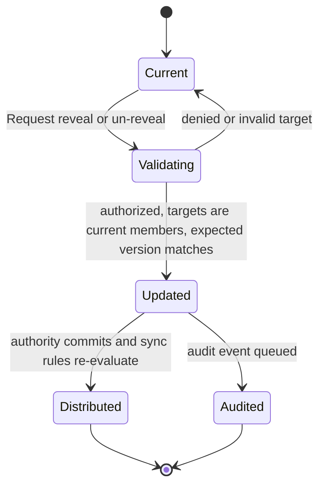

# Domain: Visibility and Authorization

Source: `_prd.md`, `_bdd.md`, `../00-platform-foundation/freeze-decisions.md`, and
`../01-identity-and-membership/_bdd.md`.

## Purpose

This domain exists because hiding is product behavior, not presentation. It defines one vocabulary
and one decision model shared by API authorization, synchronization, attachments, exports, and
offline reads. Transport, cookies, SQL, and sync-provider concepts stay outside this document.

## Glossary

| Term | Meaning |
| --- | --- |
| Actor | A current campaign member resolved by feature 01 as user, campaign, and role. |
| Resource Class | A registered kind of campaign content with declared capabilities and defaults. |
| Capability | A verb that may be attempted on a Resource Class, such as read, create, update, delete, reveal, or manage members. |
| Visibility | The audience carried by a record: GM only, everyone in the campaign, named parties, or named players. |
| Ownership Rule | A resource-specific restriction that may be narrower than role and Visibility, such as an author-private player note. |
| Decision | An `allow` or `deny` outcome with a stable reason, derived from declared inputs. |
| Grant | A named player or party included in targeted Visibility. |
| Reveal | An additive Visibility change that expands the permitted audience. |
| Un-reveal | A Visibility change that removes future access; it cannot revoke knowledge already acquired. |
| Declaration | The single Resource Class policy from which application decisions, sync predicates, defaults, and matrix tests derive. |

`hidden`, `private`, and `secret` are not authorization states. Specifications use the exact
Visibility mode or Ownership Rule.

## Actors and Responsibilities

| Actor | Responsibility |
| --- | --- |
| Campaign member | Attempts an operation; never supplies their trusted role. |
| Resource owner feature | Registers its Resource Class, capabilities, default Visibility, ownership fields, and persistence adapter. |
| Policy service | Evaluates Decisions and validates Visibility changes. |
| Sync boundary | Applies the same declaration before data leaves the authority. |
| Audit recorder | Records accepted reveal and un-reveal changes without influencing the Decision. |

## Decision Inputs and Outcome

A Decision uses only:

- the authoritative Actor;
- the requested Capability;
- the registered Resource Class declaration;
- the record's campaign, Visibility, and resource-specific ownership facts;
- current campaign membership or party membership when a targeted grant requires it.

It returns either `allow(reason)` or `deny(reason)`. Request objects, client claims, interface
state, and the existence of a control are never inputs.

Evaluation order is fail-closed:

1. Actor exists and belongs to the record's campaign.
2. Role is an MVP role; `observer` has no capabilities.
3. Resource Class and Capability are registered.
4. Resource-specific Ownership Rules are satisfied.
5. Role capability permits the operation.
6. Visibility permits reads or reveal-derived delivery.

A failure at any step is a denial. Public boundaries may translate several denial reasons into
the same `not_found_or_forbidden` result to avoid existence disclosure.

## Resource Class Declaration

Each content owner declares:

- stable class identifier;
- supported capabilities by role;
- default Visibility or a requirement for explicit Visibility;
- how campaign, Visibility, author/owner, and version are read;
- whether an Ownership Rule overrides GM-role access;
- how an accepted versioned Visibility update is persisted;
- the equivalent sync predicate.

The declaration is registered at composition time. Unknown classes and undeclared combinations
deny. A feature does not import another feature's table or implement role checks locally.

## Author-Private Content

The frozen product decision says player-authored notes are private to their author, including from
GM roles. This is modeled as an Ownership Rule on that Resource Class, not as a new global
Visibility mode:

- only the author may read the note;
- no role override applies;
- sync targets only the author's active membership;
- removing that membership removes the note from the device but does not delete campaign data;
- export follows the owning feature's explicit policy and must not widen access.

This avoids changing the frozen `Visibility` union while making the exceptional rule explicit.

## Visibility Change Flow

Reveal is set-union for recipients and is idempotent. Un-reveal is set subtraction. Removing the
last targeted recipient changes the mode to `gm_only`, because an empty targeted Visibility is not
representable. Concurrent changes use the record version; one accepted write cannot silently erase
another grant.

Party Visibility remains representable but fails closed in P0 because no Track A feature owns a
party-membership source. Feature 04 activates it only after a party resolver is registered; the
user-facing party flow remains P1.

## Invariants

| # | Invariant |
| --- | --- |
| I1 | No Decision allows an unknown role, class, capability, or Visibility. |
| I2 | Authority in one campaign grants nothing in another. |
| I3 | A record absent from an Actor's permitted set never reaches that Actor's replica. |
| I4 | API and sync outcomes derive from one Resource Class declaration. |
| I5 | A denial and a missing hidden record are publicly indistinguishable. |
| I6 | A Reveal only adds valid current campaign recipients and never duplicates one. |
| I7 | Un-reveal removes future delivery but makes no claim about prior knowledge. |
| I8 | Every accepted Visibility change is versioned and audited. |
| I9 | Author-private content is readable only by its author, regardless of GM role. |
| I10 | Counts, tombstones, attachment access, and audit rows cannot become side channels. |

## Domain Events

- Visibility Revealed
- Visibility Unrevealed
- Visibility Change Rejected
- Resource Policy Registered
- Resource Policy Registration Rejected

Only accepted Visibility changes become campaign audit events. Denial telemetry is aggregated and
does not identify individual player attempts.

## Relationship to Other Features

| Feature | Boundary |
| --- | --- |
| 01 identity | Supplies authoritative Actor and current membership facts. |
| 03 sync | Enforces generated sync predicates and removes no-longer-visible rows. |
| 05 attachments | Authorizes signed URLs using the owning record's Decision. |
| 06 audit | Records accepted Visibility changes and filters visible history. |
| 07 import/export | Preserves Visibility and Ownership Rule data without widening access. |
| Content owners | Register Resource Classes and persist their own records. |

## Traceability

| Domain rule | BDD coverage |
| --- | --- |
| Decision inputs/order, I1–I2 | The Decision Point; Roles and Capabilities |
| Declaration and I4 | Both rules come from one declaration; Every content-owning class runs the shared matrix |
| Visibility modes, I3 | Visibility Levels; Sync Rules and API Rules Agree |
| Reveal flow, I6–I8 | Changing Visibility |
| Author-private rule, I9 | A player-authored private note is not readable by a GM role |
| Side-channel rule, I5/I10 | Denials Reveal Nothing; hidden attachment and tombstone scenarios |
| Offline equivalence | Offline scenarios |

## Settled Scope Decisions

- `observer` denies every MVP capability.
- Author-private notes use a resource Ownership Rule; no frozen contract change is required.
- Party Visibility fails closed until a party resolver exists; party targeting remains P1.
- Un-reveal is supported in P0 and removes local data on the next synchronization.
- Visibility change is a normal versioned update, with additive reveal semantics implemented by
  reading the latest version and retrying only after an explicit conflict outcome.

